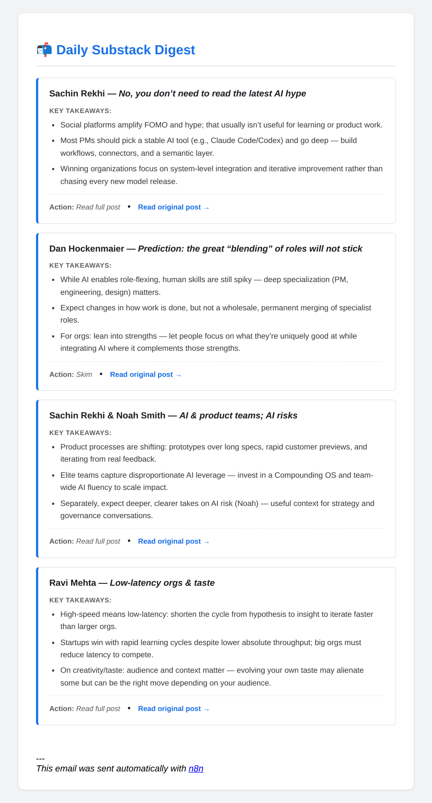
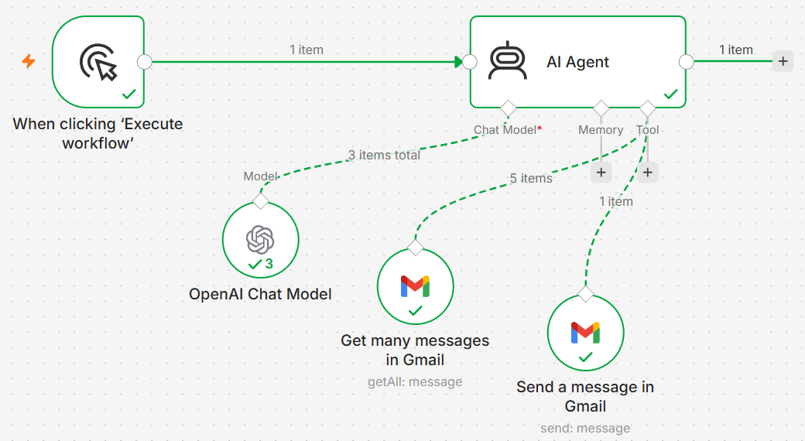

# Substack Digest Agent

An n8n workflow that uses an AI agent to summarize Substack newsletter emails from Gmail and deliver them as a single, prioritized HTML digest.

## Overview

Newsletter subscriptions accumulate quickly, and a large unread backlog makes it difficult to decide which posts are worth reading. This workflow addresses that by condensing each newsletter into a short summary with a recommended action, so the reader can triage the backlog in minutes and open only the posts that matter.

## Features

- Retrieves Substack emails from Gmail and skips account emails (sign-in links, receipts, confirmations)
- Extracts the author or publication, subject, and post URL from each email
- Creates one card per newsletter with 3 key takeaways
- Recommends an action for each post: **Read full post**, **Skim**, or **Archive**
- Sends a single, mobile-friendly HTML digest with a dated subject line
- Sends nothing when there are no new newsletters
- Links every summary back to the original post

## Architecture

The workflow is built around an n8n **AI Agent** node. The agent is given two Gmail tools and decides when to call each one.

| Node | Type | Purpose |
|------|------|---------|
| When clicking 'Execute workflow' | Manual Trigger | Starts the workflow on demand |
| AI Agent | LangChain Agent | Orchestrates the steps and generates the digest |
| OpenAI Chat Model | Language model (`gpt-5-mini`) | Summarization, prioritization and HTML formatting |
| Get many messages in Gmail | Gmail tool (`getAll`) | Fetches unread Substack emails from the last 24 hours (`from:no-reply@substack.com is:unread newer_than:1d`) |
| Send a message in Gmail | Gmail tool (`send`) | Sends the generated digest |

**Execution flow**

1. The trigger starts the AI Agent.
2. The agent calls the Gmail tool to fetch recent Substack emails.
3. The language model extracts metadata, summarizes each post and assigns a recommended action.
4. The agent renders the results into an HTML template defined in the prompt.
5. The agent calls the Gmail send tool once to deliver the digest, or sends nothing if no newsletters were found.

## Design decisions

| Decision | Rationale |
|----------|-----------|
| Deliver the digest by email | Fits into an existing reading habit; no additional app or dashboard required |
| Link back to every original post | Summaries act as a filter for what to read, not a replacement for the content |
| Use AI only for judgment-based steps | Fetching and sending are deterministic automation; the model is used for summarization and prioritization |
| Fixed HTML template in the prompt | Produces consistent, readable output across runs |

## Prerequisites

- An [n8n](https://n8n.io) instance (cloud or self-hosted)
- A Gmail account with OAuth2 access configured in n8n
- OpenAI API access

## Installation

1. Download [`workflow/substack-digest-agent.json`](workflow/substack-digest-agent.json).
2. In n8n, create a new workflow and select **Import from File**.
3. Configure credentials:
   - **Gmail OAuth2** on both Gmail nodes
   - **OpenAI** on the OpenAI Chat Model node
4. In the **Send a message in Gmail** node, replace `your-email@example.com` with the recipient address.
5. Click **Execute workflow** to generate and send a digest.

## Configuration

| Setting | Location | Default |
|---------|----------|---------|
| Email filter | Get many messages in Gmail → Filters → Search | `from:no-reply@substack.com is:unread newer_than:1d` |
| Recipient | Send a message in Gmail → To | `your-email@example.com` |
| Model | OpenAI Chat Model → Model | `gpt-5-mini` |
| Max agent iterations | AI Agent → Options | `10` |
| Digest layout and actions | AI Agent → Prompt | HTML template |

## Known limitations

- Runs on a manual trigger; no scheduled execution yet
- Processed emails are not marked as read, so running the workflow twice in one day can produce a repeated digest
- No memory of user behavior; recommendations do not adapt over time
- Tested with a single user's inbox

## Roadmap

- [ ] Scheduled daily execution
- [x] Filter to unread emails from the last 24 hours
- [ ] Mark processed emails as read
- [ ] Agent memory to personalize recommendations based on reading behavior
- [ ] Validation with additional users
